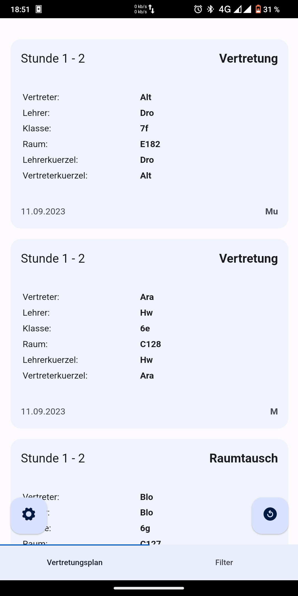
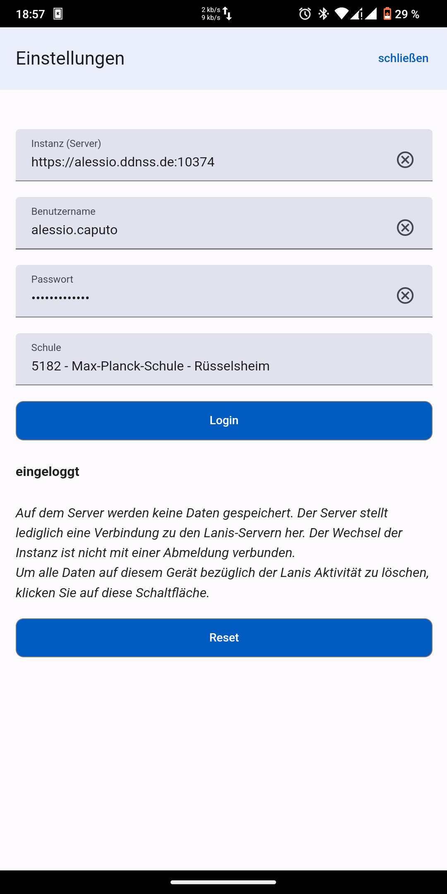

# SPH-Vertretungsplan

<i>Work in progress</i>

Vplan anschicht         |  Einstellungen
:----------------------------:|:----------------------------:
 | 

## sehr frühe dev version!
Aktuell ist die App zwar funktionsfähig, es sind aber einige Features noch nicht Implementiert. Auch ist mit Bugs zu rechnen!

Zum Ausprobieren kann die Server-Instanz im Bild verwendet werden. 

## Diese App soll 2 probleme Lösen:

- den Vertrtungsplan schnell abrufen
    - login dauert lange
- den Filter für den eigenen Plan verbessern, weil der normale Schrott ist. 

## Alles auf einem gerät?
Ursprünglich war der Plan mein npm Packet <a href="https://www.npmjs.com/package/sphclient">SPHclient</a> auf der Client seite zu verwenden, um ein Serverloses abrufen zur ermöglichen.   Es stellt sich heraus, dass CORS das nicht zulässt. <a href="https://ionicframework.com/docs/troubleshooting/cors">siehe hier</a>

## Server also?
Ja, aber der Server ist so konzipiert, dass ihn jeder nutzen kann. Er speichert keine Benutzerdaten, sondern erfüllt eher eine Proxy-Funktion erfüllen.