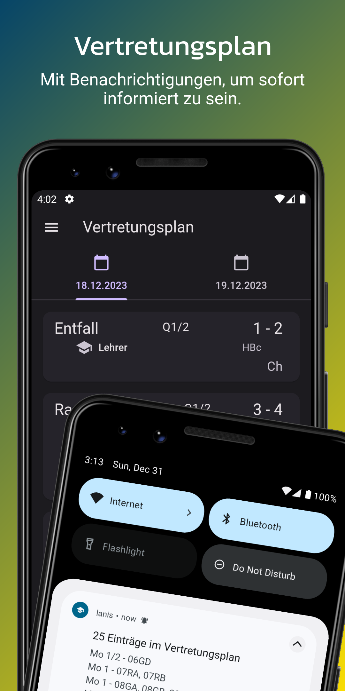
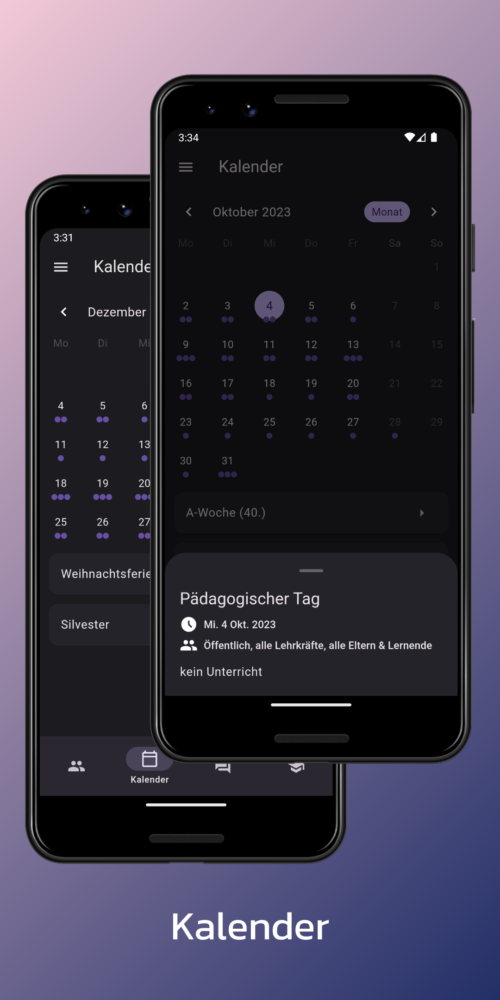
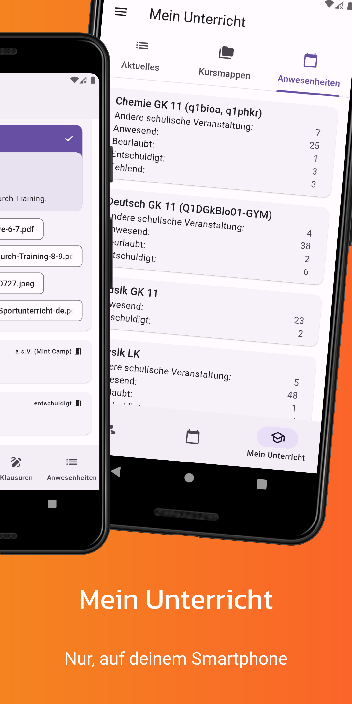
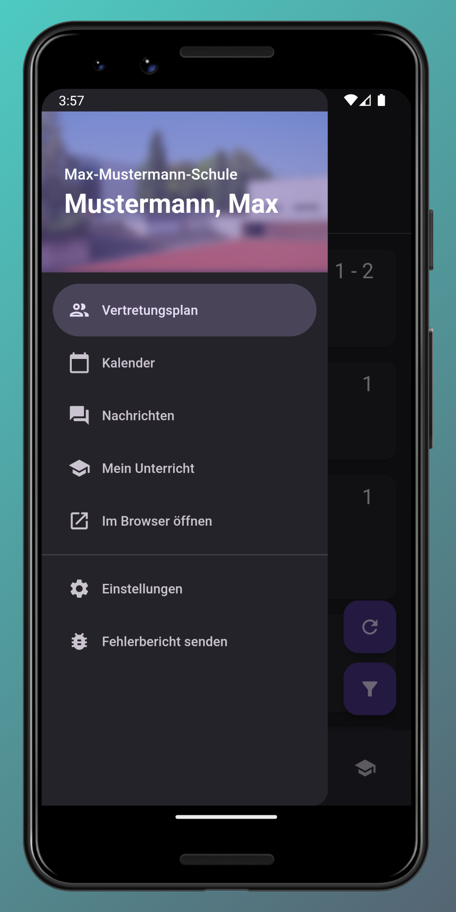
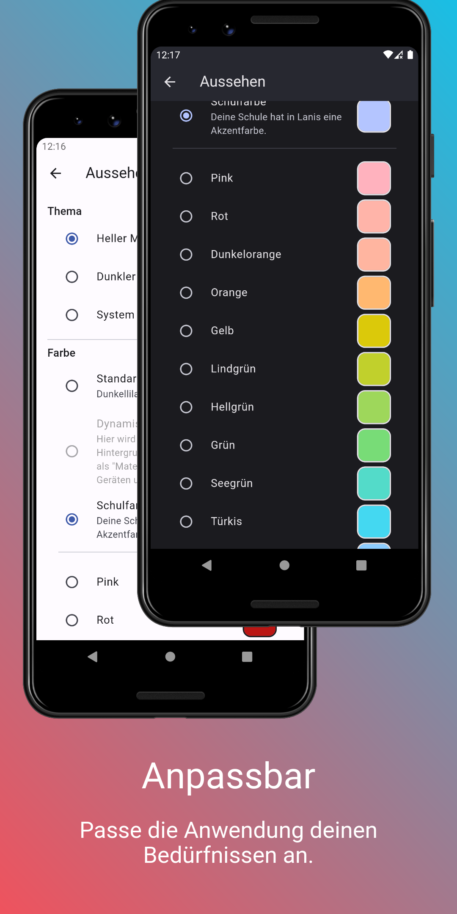

# Lanis Mobile
Inoffizielle App rund um das Schulportal Hessen. Unterstützung für den Vertretungsplan, "Mein Unterricht", Nachrichten und den Schulkalender mit mehr Geplant. 

    

  
Screenshots

  
  
  
  
  
  
  

## Hilf mit!
Wir sind offen für neue Colaborator. Aber auch wenn du nicht coden kannst, bist du in der Lage einen beitrag zur App zu leisten. Du kannst den Vertretungsplan deiner Schule anpassen. Siehe [hier](https://github.com/alessioC42/lanis-mobile-autoconfig/issues/1) und [hier](https://github.com/alessioC42/lanis-mobile-autoconfig)

## features
- [x] Login
- [x] Vertretungsplan
- [x] Vertretungsplan Push benachrichtigungen (Android)
- [x] Schulkalender
- [x] Lanis eingeloggt im browser öffnen
- [x] Benutzerdaten
- [x] Mein Unterricht
- [x] Nachrichten
- [ ] Stundenplan (In Arbeit)

Es werden anonyme Daten zur Fehleranalyse erhoben. (Optional)

## IOS/IpadOS support
Working on it.

## Mitarbeit
[Schulkonfiguration der Vertretungspläne](https://github.com/alessioC42/lanis-mobile-autoconfig)

Dieses Projekt ist stark von Bug-Reports anderer Schulen oder von neuen Mitarbeitern abhängig. Der Grund dafür liegt in
der modularen Natur des Schulportals, die es äußerst schwierig macht, eine universelle Lanis-App zu entwickeln.

Bug-Reports können auch an <a href="mailto:alessioc42.dev@gmail.com">diese</a> E-Mail-Adresse gesendet werden, falls kein Github-Konto vorhanden ist.

