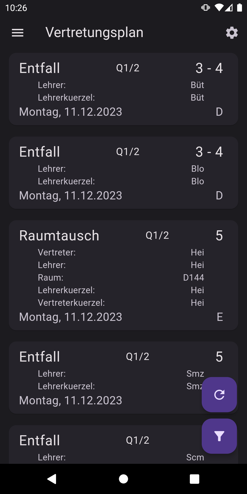
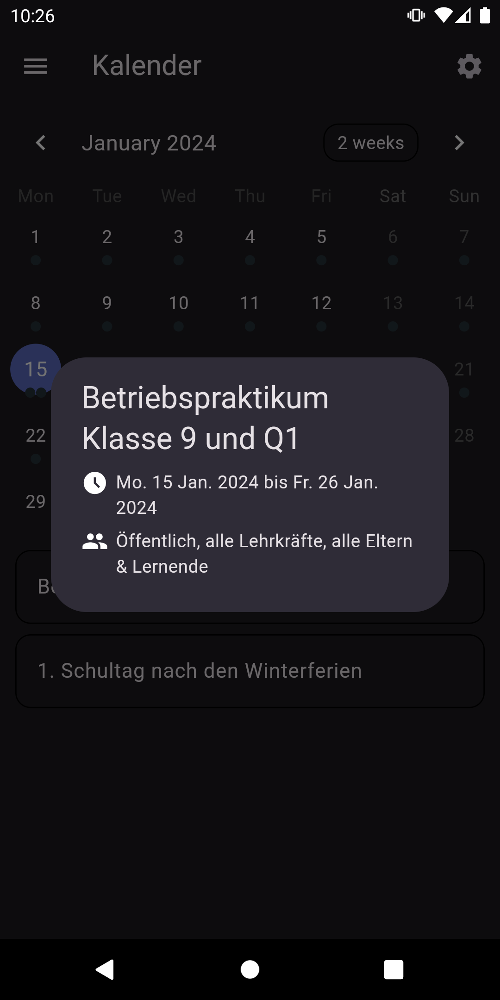
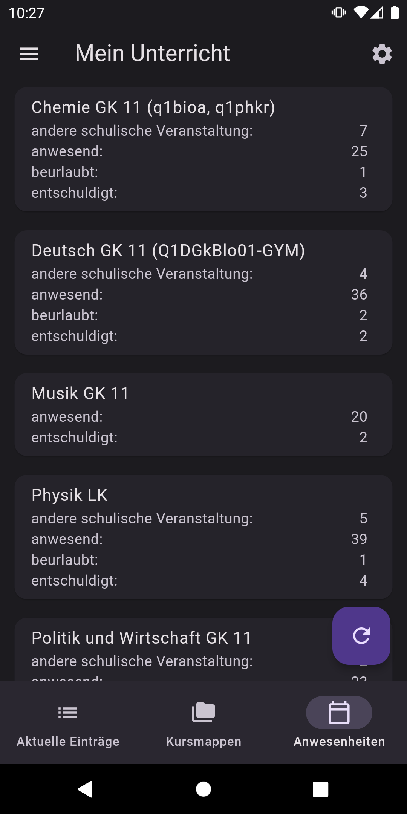
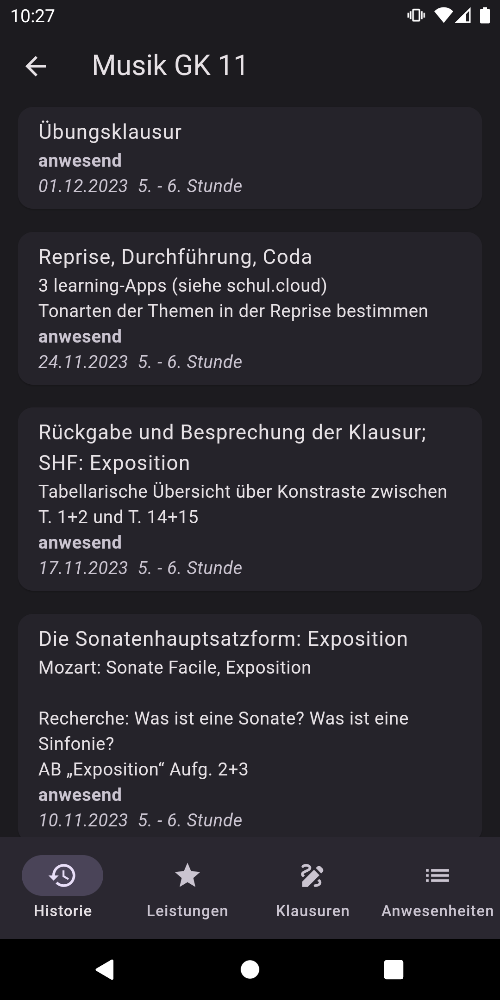
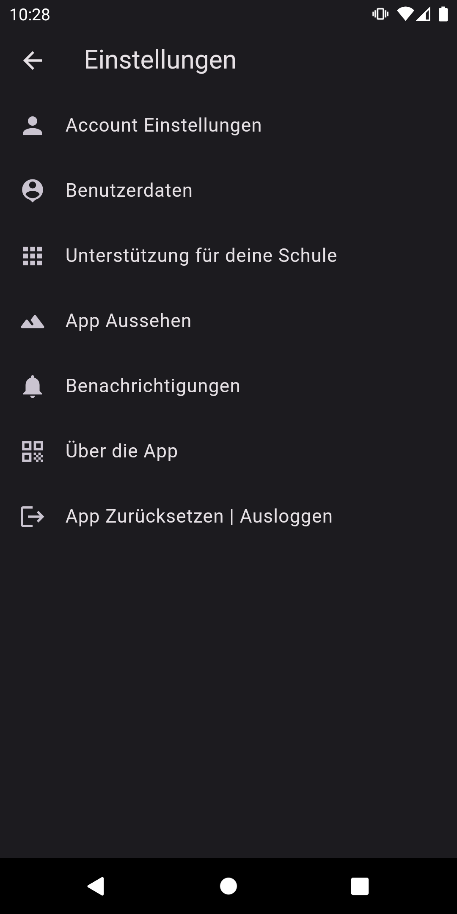
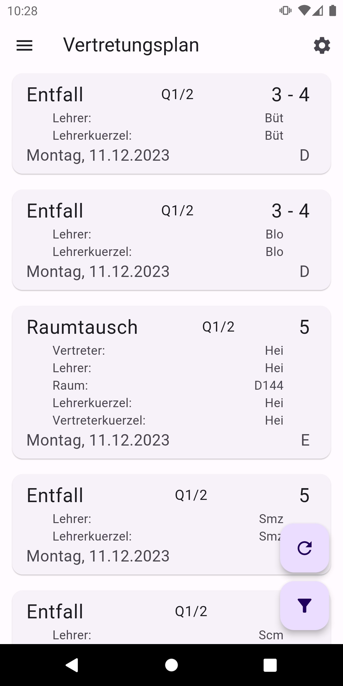
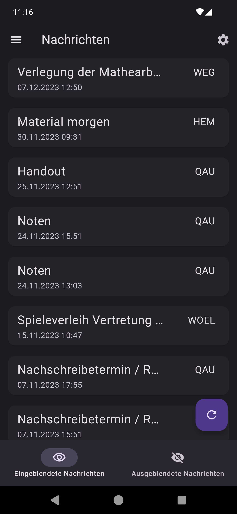
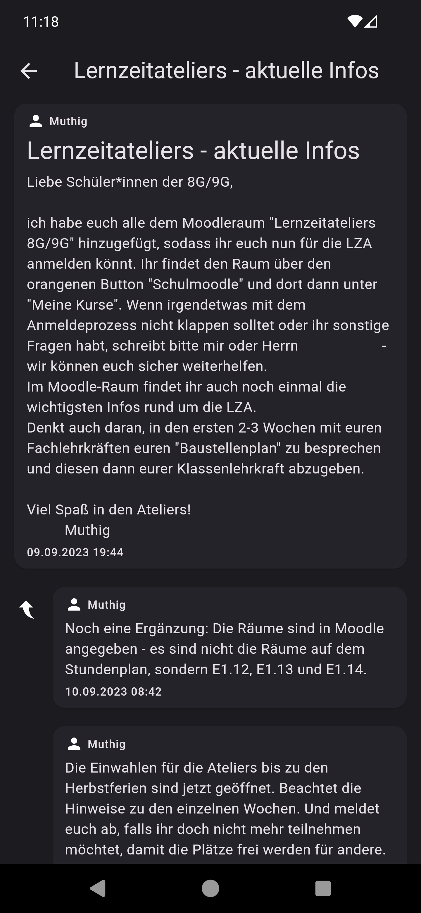

# Lanis Mobile
Inoffizielle Android App rund um das Schulportal Hessen. Unterstützung für den Vertretungsplan, "Mein Unterricht", Nachrichten und den Schulkalender mit mehr Geplant. 

    

  
Screenshots

    
    
    
    
    
    
    
    

## features
- [x] Login
- [x] Vertretungsplan
- [x] Vertretungsplan Push benachrichtigungen
- [x] Schulkalender
- [x] Lanis eingeloggt im browser öffnen
- [x] Benutzerdaten
- [x] Mein Unterricht
- [x] Nachrichten

## Datenschutz und Verschlüsselung
Alle Daten werden verschlüsselt auf dem Gerät gespeichert. Die gesamte Kommunikation erfolgt direkt mit den Lanis-Servern.
Sensible Daten (wie Noten, Anwesenheiten, etc.) werden durch Ende-zu-Ende-Verschlüsselung geschützt.

Es werden anonyme Daten zur Fehleranalyse erhoben. (Optional)

## IOS/IpadOS support
Bisher hat keiner der Entwickler zugang zu einer Apple-Entwicklungsumgebung. Zudem wäre ein Jährliches Abo von 100USD notwendig, um die App in den Apple App Store zu bringen.

Mit dem kommenden Sideloading auf IOS geräten ändert sich das eventuell.

## Mitarbeit
Dieses Projekt ist stark von Bug-Reports anderer Schulen oder von neuen Mitarbeitern abhängig. Der Grund dafür liegt in
der modularen Natur des Schulportals, die es äußerst schwierig macht, eine universelle Lanis-App zu entwickeln.

Bug-Reports können auch an <a href="mailto:alessioc42.dev@gmail.com">diese</a> E-Mail-Adresse gesendet werden, falls kein Github-Konto vorhanden ist.

